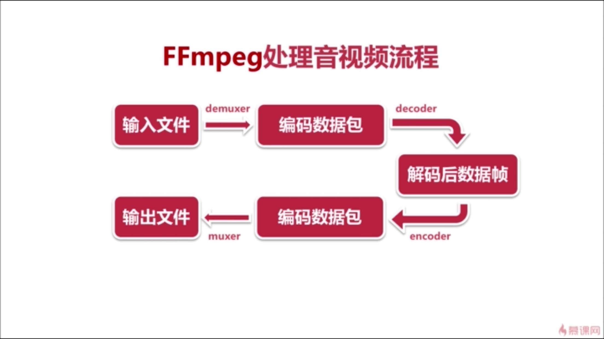

### FFmpeg 常用命令

##### FFmpeg处理流程

【输入文件】——解封装—— 【编码数据包】——解码—— 【解码后数据帧】——编码—— 【编码数据包】——封装—— 【输出文件】
输入文件：比如 mp4 文件
编码数据包：比如mp4文件分解后的音频、视频数据。
解码数据：因为拿到的编码数据(音频、视频)是一种压缩数据，所以要进行解码；但是解码后的数据跟真正的原始数据还是有差别的。所以处理数据基本都是处理解码后的数据。
编码数据：也就是在处理完原始数据后，需要重新进行编码和封装。最好生成新的输出数据。

##### FFmpeg 命令分类
* 基本信息查询命令:
  

* **录制命令**:
  * **ffmpeg  -f  avfoundation  -i  1  -r  30  out.yuv**
    -f：指定使用avfoundation库采集数据。(在mac系统下，avfoundation库是专门用于处理音视频的)；
    -i：指定从哪采集数据，它是一个文件索引号，(这里的1就是一个索引值，代表屏幕；0代码摄像头)；
    -r：指定帧率，这里是30帧；
    out：采集的数据保存成yuv数据(yuv数据是原始数据，没有压缩，所以比较大)
  * **ffplay  -s  2880x1800  -pix_fmt  uyvy422  out.yuv**
    这条命令是使用ffplay播放刚才录制的 out.yuv ; -s 2880x1800 是视频录制时的分辨率；-pix_fmt uyvy422 是视频录制的编码格式。
  * **ffmpeg  -f  avfoundation  -list_devices  true  -i  "" **
    使用这条命令查看avfoundation库支持哪些设备，我们可以看到有两个video devices和一个audio devices。其中video devices中，0是Camara，1是Screen；audio devices中0是内置麦克风。这里我们发现video和audio都有0和1，那么怎么录制音频呢？或者音视频一起呢？
  * **ffmpeg -f avfoundation -i :0 out.wav **
    录制音频和录制视频的命令差不多，唯一就是 -i 输入的视频设备放在 ：之前； 音频设备要放在 ：之后。
  * **ffplay out.wav**
    播放音频
  * **ffmpeg -f avfoundation -framerate 30 -i "0:0" -vcodec libx264 -preset veryfast -f flv ~/Desktop/test.mkv**
    同时录制音视频

* **分解/复用（格式的转换）命令**：
  * **ffmpeg -i out.mp4 -vcodec copy -acodec copy out.flv **
    -i：输入文件
    -vcodec copy：视频编码处理方式 (这里copy是指不作任何处理)
    -acodec copy：音频编码处理方式
  * ** ffmpeg  -i f35.mov -an -vcodec copy out.h264 **
    单独提取视频文件
    -an：是指不需要音频 audio no
  * **ffmpeg -i f35.mov -acodec copy -vn out.aac**
    单独抽取音频 
    -vn：是指不需要视频 video no
  
* **处理原始数据命令**：
    什么是原始数据？对于音频就是pcm数据，视频就是yuv数据。
  * **ffmpeg  -i input.mp4 -an -c:v rawvideo -pix_fmt yuv420p out.yuv**
    -c:v rawvideo ：表示对视频进行编码，使用rawvideo（原始视频）进行编码，
    -pix_fmt yuv420p ：像素格式
  * **ffmpeg -i input.mp4 -vn -ar 44100 -ac 2 -f  s16le out.pcm**
    -vn：不需要视频
    -ar：audio read ，音频采样率 44.1k。 常用的采样率有48k、32k、16k；
    -ac：audio channel,声道。2是指双声道；
    -f： 抽取的音频数据存储格式。s表示有符号数据，有正有负；16表示每个数使用16位数存储方式；

* 裁剪与合并命令：

* 图片/视频互转命令：

* 直播(推流、拉流)相关命令：

* 各种滤镜命令：

